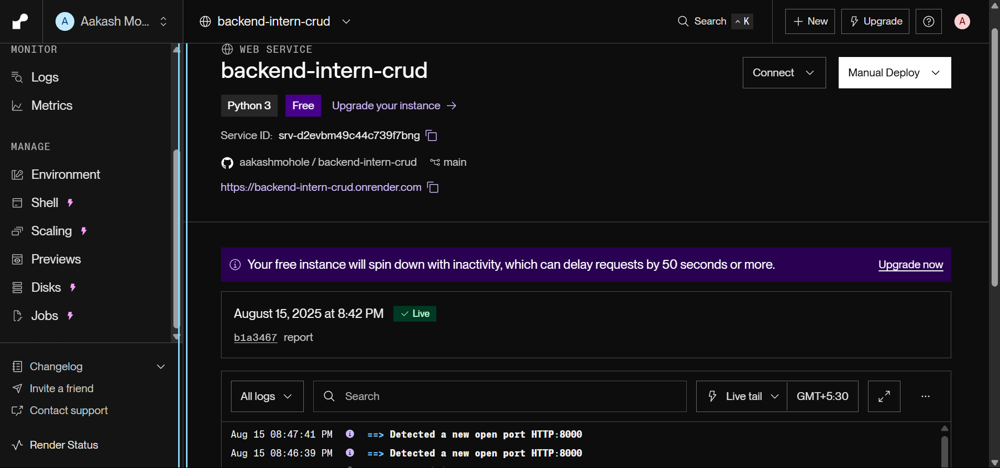

# LawVriksh Blog Management System

A blog management backend system built with FastAPI offering CRUD operations, likes, comments, and JWT authentication, using NeonDB (PostgreSQL compatible) as the database.

***

## Deployed Link (Additional I also deployed backend on render) 
 - chech this link - https://backend-intern-crud.onrender.com



## Table of Contents

- [Task Overview](#project-overview)
- [Features](#features)
- [Tech Stack](#tech-stack)
- [Project Structure](#project-structure)
- [Setup & Installation](#setup--installation)
- [Running the Project](#running-the-project)
- [API Documentation](#api-documentation)
- [Postman Collection](#postman-collection)
- [Authentication](#authentication)
- [Usage Examples](#usage-examples)
- [Deployment Pipeline (Final Report)](#deployment-pipeline-final-report)

***

## Project Overview

This project is a backend system for managing blog posts, where users can create, read, update, and delete posts, as well as like and comment on posts. It implements JWT-based authentication to secure writing operations. The persistence layer uses NeonDB, a PostgreSQL-compatible cloud database service.

***

## Features

- Create, Read, Update, Delete (CRUD) for blog posts
- Like functionality with restriction to prevent multiple likes per user per post
- Comment functionality with list and create operations
- JWT Authentication for write operations
- Structured and modular FastAPI project
- Full Postman collection for easy API testing

***

## Tech Stack

- Python 3.10+
- FastAPI
- SQLAlchemy (synchronous)
- NeonDB (PostgreSQL compatible)
- Pydantic for data validation
- JWT (JSON Web Tokens) for authentication
- Postman (for API testing)

***

## Project Structure

```
backend-intern-crud/
│
├── src/
│   ├── api/
│   │   ├── auth.py           # Registration & Login endpoints
│   │   ├── posts.py          # Post CRUD, Likes, Comments endpoints
│   │   ├── dependencies.py   # JWT authentication dependencies
│   │
│   ├── core/
│   │   ├── config.py         # Configurations, env settings
│   │   └── security.py       # Password hashing and JWT utilities
│   │
│   ├── db/
│   │   └── database.py       # SQLAlchemy engine, Session, Base & get_db()
│   │
│   ├── models/
│   │   └── post.py           # ORM models: User, Post, Like, Comment
│   │
│   ├── schemas/
│   │   ├── user.py           # Pydantic schemas for User
│   │   ├── post.py           # Pydantic schemas for Post
│   │   └── comment.py        # Pydantic schemas for Comment
│   │
│   └── main.py               # FastAPI app instance and router mount
│
├── .env                      # Environment variables (DB URL, JWT secret)
├── requirements.txt          # Project dependencies
├── postman_collection.json   # Postman collection for API testing
├── README.md                 # This document
```

***

## Setup & Installation

1. Clone the repository:

```bash
git clone 
cd backend-intern-crud
```

2. Create and activate a virtual environment:

```bash
python -m venv env
source env/bin/activate      # macOS/Linux
.\env\Scripts\activate       # Windows
```

3. Install dependencies:

```bash
pip install -r requirements.txt
```

4. Create `.env` file in the root directory with the following variables:

```
NEONDB_URL=postgresql://:@/?sslmode=require&channel_binding=require
JWT_SECRET=your_jwt_secret_key
ACCESS_TOKEN_EXPIRE_MINUTES=30
```

Replace placeholders with your actual NeonDB credentials and a secure JWT secret.

***

## Running the Project

Start the FastAPI server with Uvicorn:

```bash
uvicorn src.main:app --reload
```

The API will be accessible at: [http://localhost:8000](http://localhost:8000)

***

## API Documentation

You can access interactive API docs generated by FastAPI:

- Swagger UI: [http://localhost:8000/docs](http://localhost:8000/docs)
- Redoc: [http://localhost:8000/redoc](http://localhost:8000/redoc)

***

## Postman Collection

The `postman_collection.json` file in the project root includes requests for:

- User registration and login (auth)
- CRUD operations on posts
- Like and Comment workflows
- Examples of authorized and unauthorized requests

**Usage Steps:**

1. Import the collection into Postman.
2. Run the Register endpoint to create a user.
3. Run the Login endpoint to get a JWT token.
4. Set the `{{token}}` variable in Postman with the JWT token.
5. Test authorized endpoints using this token.

***

## Authentication

- All write operations require a Bearer JWT token.
- The `/api/auth/register` endpoint to create a new user (username, email, password).
- The `/api/auth/login` endpoint to authenticate and retrieve a JWT token.

***

## Usage Examples

### Create a blog post

POST `/api/posts`  
Headers: Authorization: Bearer ``  
Body:

```json
{
  "title": "My First Post",
  "content": "Hello, this is my first blog post!"
}
```

### Like a post

POST `/api/posts/{id}/like`  
Headers: Authorization: Bearer ``

### Add a comment

POST `/api/posts/{id}/comment`  
Headers: Authorization: Bearer ``  
Body:

```json
{
  "content": "Great post!"
}
```

***
